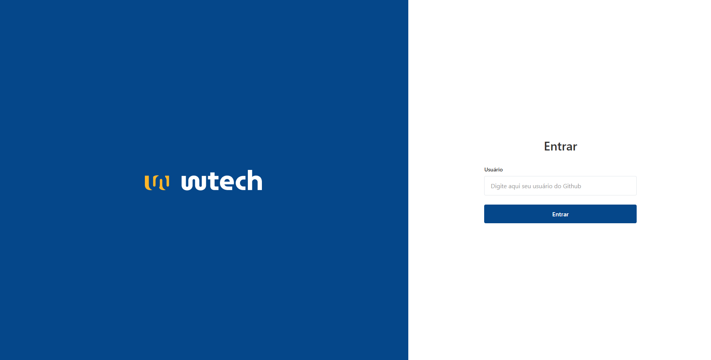
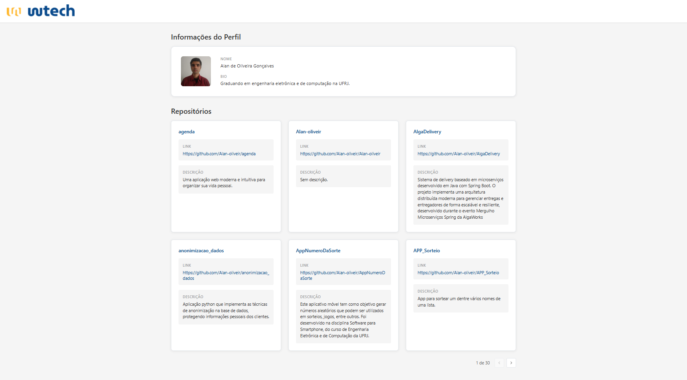

# 🔍 GitHub Explorer

<div align="center">
  
  
  
  
</div>

<br />

> Aplicação web responsiva para exploração de perfis e repositórios do GitHub, desenvolvida como desafio final do Módulo 3 - React & TypeScript.

## 📸 Preview

  


## 🎯 Sobre o Projeto

Esta aplicação permite aos usuários pesquisar perfis do GitHub e visualizar informações detalhadas sobre seus repositórios de forma intuitiva e responsiva. O projeto integra consumo de API real, gerenciamento de estados complexos e implementa um design fiel ao protótipo Figma fornecido.

## 🚀 Deploy

  [](https://seu-projeto.vercel.app)

## ✨ Funcionalidades

- 🔎 **Busca de Usuários do GitHub**
  - Validação de campo vazio
  - Verificação de existência do usuário
  - Feedback visual durante o carregamento
  - Tratamento de erros com mensagens específicas

- 👤 **Visualização de Perfil**
  - Avatar do usuário
  - Nome completo
  - Biografia
  - Lista de repositórios públicos

- 📦 **Cards de Repositórios**
  - Nome do repositório
  - Link direto para o GitHub
  - Descrição do projeto
  - Layout responsivo em grid

- 🔍 **Modal de Detalhes**
  - Tipo de privacidade (público/privado)
  - Linguagem principal
  - Descrição completa
  - Link de acesso ao projeto
  - Fechamento via ESC, clique fora ou botão X

- 📄 **Paginação Inteligente**
  - Visualização de 6 repositórios por página
  - Navegação anterior/próxima
  - Contador de itens

- 📱 **Design Responsivo**
  - Adaptação para desktop, tablet e mobile
  - Grid dinâmico baseado no tamanho da tela

## 🛠️ Tecnologias Utilizadas

- **[React](https://react.dev/)** - Biblioteca JavaScript para construção de interfaces
- **[TypeScript](https://www.typescriptlang.org/)** - Superset JavaScript com tipagem estática
- **[Styled Components](https://styled-components.com/)** - CSS-in-JS para estilização
- **[React Router v6](https://reactrouter.com/)** - Roteamento e navegação
- **[GitHub REST API](https://docs.github.com/en/rest)** - API para dados de usuários e repositórios
- **[Vite](https://vitejs.dev/)** - Build tool e dev server

## 🏗️ Arquitetura do Projeto

```
src/
├── assets/          # Imagens e recursos estáticos
├── components/      # Componentes reutilizáveis
│   └── Modal.tsx
├── pages/          # Páginas da aplicação
│   ├── Search.tsx
│   └── Profile.tsx
├── styles/         # Arquivos de estilização
│   ├── GlobalStyles.ts
│   ├── Search.styles.ts
│   ├── Profile.styles.ts
│   ├── Modal.styles.ts
│   └── theme.ts
├── routes.tsx      # Configuração de rotas
├── App.tsx         # Componente principal
└── main.tsx        # Ponto de entrada
```

## 🚀 Como Executar

### Pré-requisitos

- Node.js 18+ instalado
- npm ou yarn

### Instalação

1. Clone o repositório

2. Acesse a pasta do projeto

3. Instale as dependências
```bash
npm install
```

4. Inicie o servidor de desenvolvimento
```bash
npm run dev
```

5. Acesse a aplicação em `http://localhost:5173`

## 🧪 Scripts Disponíveis

```bash
npm run dev        # Inicia o servidor de desenvolvimento
npm run build      # Cria build de produção
npm run preview    # Visualiza build de produção localmente
npm run lint       # Executa verificação de código
```

## 💡 Desafios Técnicos Superados

### 1. **Gerenciamento de Estados Assíncronos**
Implementação de múltiplos estados (loading, error, data) com tratamento adequado de cada cenário, garantindo uma experiência fluida para o usuário.

### 2. **Otimização de Requisições**
Utilização de `Promise.all` para buscar dados de perfil e repositórios simultaneamente, reduzindo o tempo de carregamento.

### 3. **Modal Acessível**
Desenvolvimento de um componente modal que:
- Bloqueia scroll da página de fundo
- Fecha com tecla ESC
- Fecha ao clicar fora
- Previne propagação de eventos

### 4. **Paginação Cliente-Side**
Implementação de lógica de paginação sem dependências externas, com cálculos precisos de índices e navegação intuitiva.

### 5. **Design System Consistente**
Criação de um tema centralizado e componentes estilizados reutilizáveis, mantendo consistência visual em toda a aplicação.

### 6. **Responsividade Avançada**
Grid CSS adaptativo que se reorganiza automaticamente baseado no viewport:
- Desktop: 3 colunas
- Tablet: 2 colunas
- Mobile: 1 coluna

## 📚 Aprendizados

- Consumo e integração com APIs REST
- Gerenciamento avançado de estados no React
- Tipagem forte com TypeScript e interfaces
- Criação de componentes reutilizáveis e escaláveis
- Implementação de rotas dinâmicas
- Styled Components e CSS-in-JS
- Boas práticas de UX/UI
- Tratamento robusto de erros

## 🎨 Design

O design da aplicação foi baseado no protótipo Figma fornecido no desafio.

## 📝 Licença

Este projeto foi desenvolvido como parte de um desafio educacional.

## 👨‍💻 Autor

Desenvolvido por **Alan de O. Gonçalves**

[](https://linkedin.com/in/alan-ogoncalves)
[](https://github.com/Alan-oliveir)
